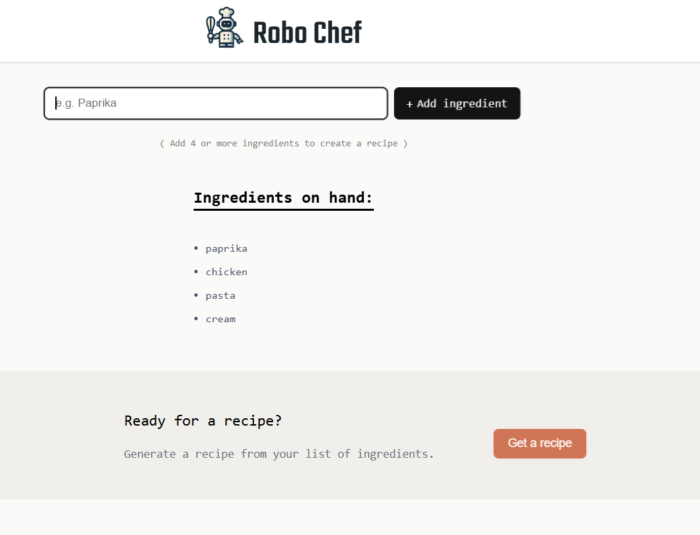
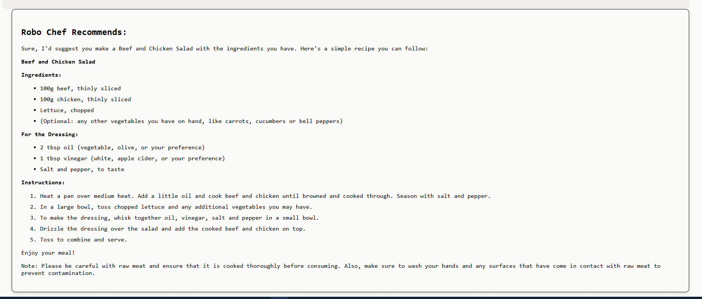

# Robo Chef AI Recipe Generator

*Robo Chef is an AI-powered recipe generator built with React. Using the Mistral AI model, users can input 4 or more ingredients, and the AI will generate a recipe that incorporates the provided ingredients.*

*If you don't know what to cook, ask Robo Chef!*

## Check out live website on Vercel !

*Live ---> <a href="https://robochef.vercel.app/" target="_blank">Robo Chef</a>*

## Features

- **Ingredient Input**: Users provide 4 or more ingredients.
- **AI Recipe Generation**: The Mistral AI model processes the input ingredients and generates a recipe.
- **React & useState**: The project is built using React with useState to handle state management.

## Screenshots

*Home Page*

*Example Recipe*

  
